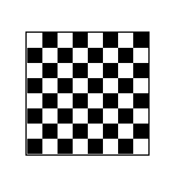

## This is a react project in which I had created cheesboard with my knowledge of building into components and styling with CSS.

In the project directory, you can run:

### `npm start`

Runs the app in the development mode.\
Open [http://localhost:3000](http://localhost:3000) to view it in the browser.

### Showcase React Page:
<table align="center">
    <tr>
        <td>
                

                    
                    
Cheesboard UI

                

            </a>
        </td>
    </tr>
</table>